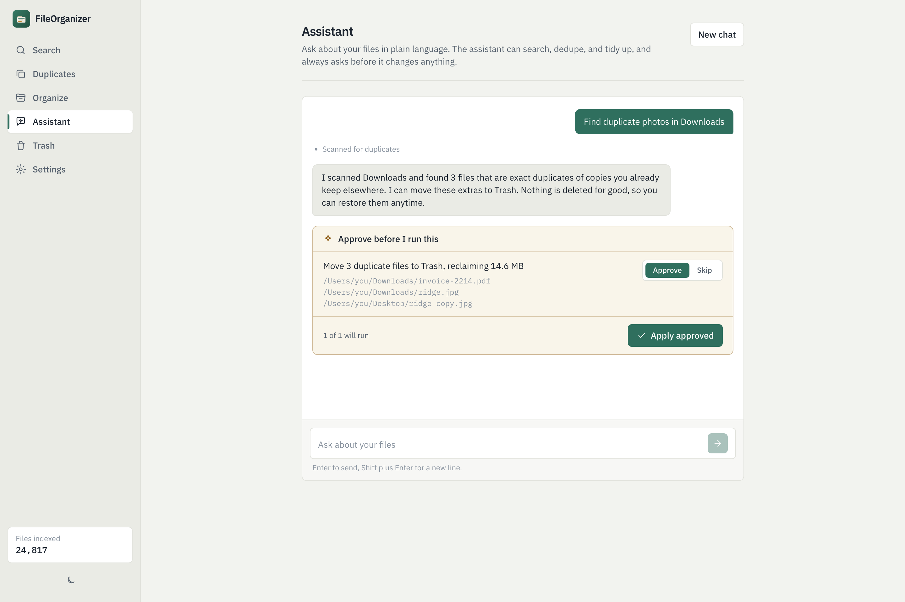
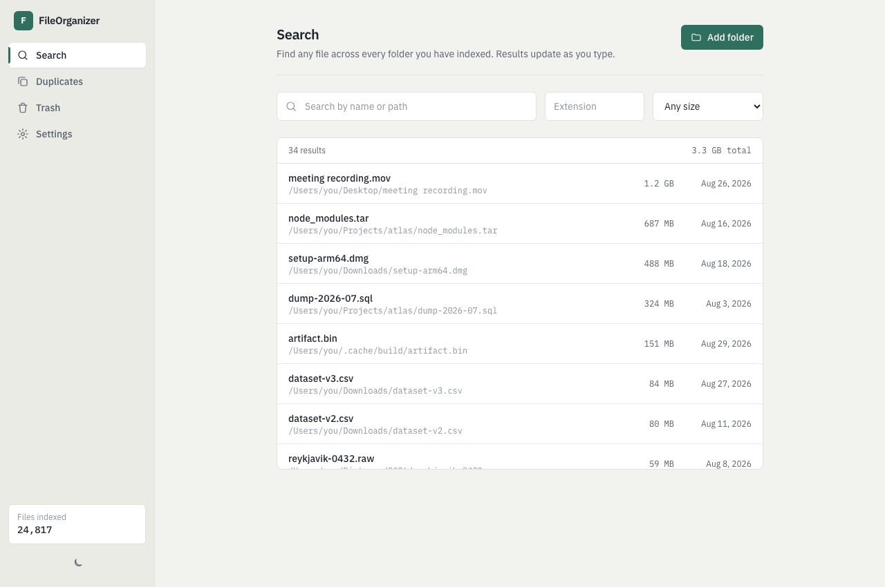
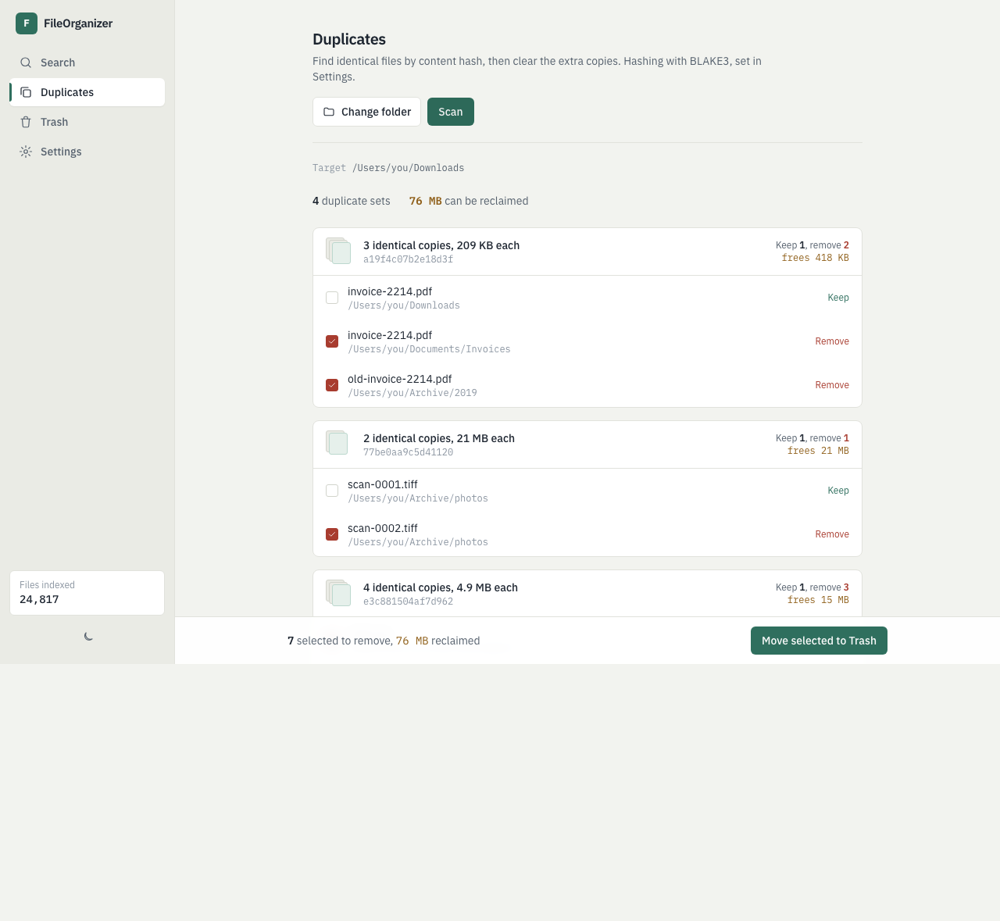
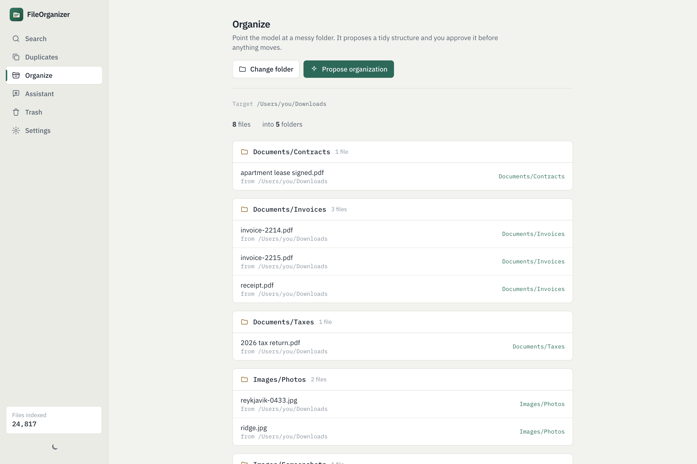
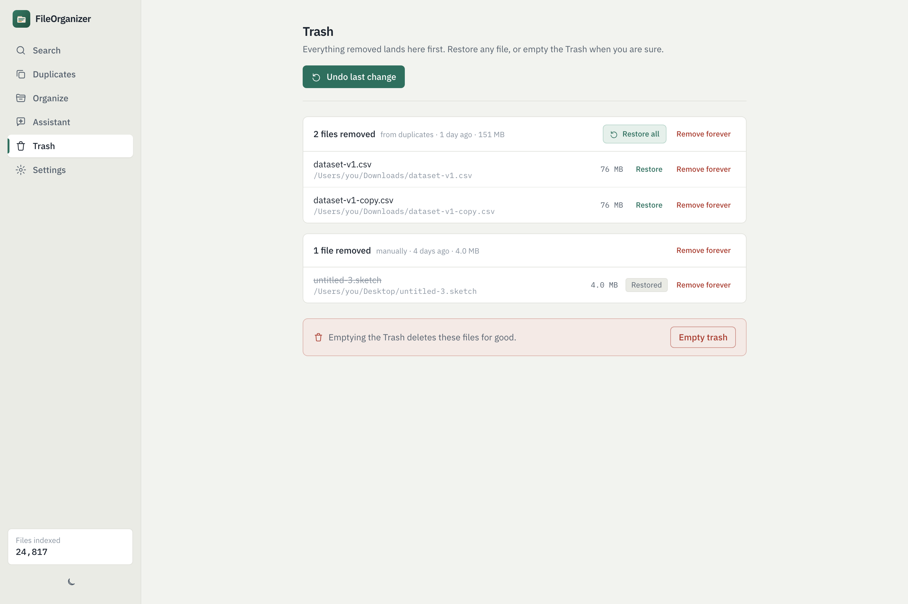

<div align="center">


<br/>
<br/>

[](https://github.com/Parham125/FileOrganizer/releases)
[](https://github.com/Parham125/FileOrganizer/releases)
[](LICENSE)


**A fast desktop app to search, index, and deduplicate your files, with an AI assistant that helps you tidy up, and asks before it touches anything.**

[Install](#install) &nbsp;·&nbsp; [Features](#features) &nbsp;·&nbsp; [Screenshots](#screenshots) &nbsp;·&nbsp; [How it works](#how-it-works) &nbsp;·&nbsp; [Build from source](#develop)

</div>

---

## Install

### Windows
Grab the latest installer from the [**Releases**](https://github.com/Parham125/FileOrganizer/releases) page:

- **`FileOrganizer_x64-setup.exe`** (NSIS installer), or
- **`FileOrganizer_x64_en-US.msi`** (MSI)

Both are built from source by GitHub Actions on every release tag. The app is not code-signed yet, so SmartScreen may warn on first run. Choose **More info -> Run anyway**.

### macOS
No signed build yet. [Build it from source](#develop) (one command), or open the locally built `.dmg`. On first open, right-click the app and choose **Open** to get past Gatekeeper.

---

## Features

🔎 **Instant search.** A live index with substring filename matching (SQLite FTS5 with a trigram tokenizer, not just prefixes), size and extension filters, in a virtualized list that stays smooth past 100k files.

♻️ **Deduplicator.** A staged pipeline (group by size, then a partial hash, then a full content hash) finds byte-for-byte duplicates without hashing everything. Parallel hashing, grouped by wasted space, safe copies preselected. BLAKE3 by default, SHA-256 optional.

🖼️ **Near-duplicate images.** Beyond exact copies, it finds photos that look the same (resaved, resized, lightly edited) using perceptual hashing, so you can clear out visual dupes too.

📄 **Search inside documents.** Index a folder once and full-text search the text inside your files: plain text, code, PDF, and DOCX.

📊 **Storage insights.** See what is actually eating your disk: total indexed size, a size-by-type breakdown, and your biggest files, with the same open, reveal, and trash actions as search.

⚙️ **Rules.** Save a filter and an action once (say, PDFs in Downloads older than 90 days go to an archive folder), see exactly which files match before you commit, then run it whenever you like. Every run goes through Trash, so it is undoable.

🗂️ **AI organizer.** Point it at a messy folder and it proposes a tidy structure. You preview every move before anything happens, and it is fully reversible.

💬 **AI assistant.** A chat that can actually act: it searches, scans for duplicates, reads your storage breakdown, and proposes changes using real tools. It can also offer to save a recurring cleanup as a rule. Replies stream in as they are written, with live tool activity and formatted markdown, and past conversations are saved so you can pick one back up. Read-only actions run on their own; anything that moves or trashes a file becomes a one-tap approval card showing exactly which files are affected.

🛟 **Safe by design.** Deletions go to an app-managed Trash with a full undo journal, kept on the same drive as the file, so trashing from an external disk is instant and costs nothing on your system drive. Restore any file, undo the last change, or remove-forever when you are sure. Moves never overwrite, and the AI has no permanent-delete power at all.

⏹️ **Built for big, slow disks.** Scans can be stopped at any point, and a sequential mode reads one file at a time, which is usually much faster on an external or spinning drive. Duplicates can be found across every drive you have indexed at once, straight from the index with no re-walk.

🗜️ **Looks inside archives.** The assistant can list what is in a `.zip`, `.tar`, `.tar.gz` or `.7z` without extracting it, so you know what a big archive holds before deciding its fate. (RAR is not supported: every Rust binding ships bundled non-free C++.)

🧠 **Reasoning, your call.** Reasoning effort is a setting (off, low, medium, high), so you decide how hard the model thinks against how many tokens it spends. Its thinking streams in, collapsed, under the answer.

🔒 **Private.** Your files never leave your machine. The only network call is to your own AI provider, using your own key. Store the key in the OS keychain, or in the app's data folder if you would rather not be asked for your password on every launch.

---

## Screenshots

<div align="center">

<p><em>The assistant proposes actions and waits for your approval, showing the exact files.</em></p>
</div>

<table>
<tr>
<td width="50%"><p align="center"><em>Instant search with multi-select</em></p></td>
<td width="50%"><p align="center"><em>Deduplicator, grouped by wasted space</em></p></td>
</tr>
<tr>
<td width="50%"><p align="center"><em>AI organize, previewed before applying</em></p></td>
<td width="50%"><p align="center"><em>Reversible Trash with undo</em></p></td>
</tr>
</table>

---

## How it works

Rust does the heavy lifting; a React UI talks to it over Tauri commands.

```
crates/
  fo-indexer   filesystem enumeration (walkdir) + Windows NTFS MFT fast path + live watcher (notify)
  fo-hasher    BLAKE3 / SHA-256, full and partial hashing
  fo-dedup     staged exact-duplicate pipeline + perceptual near-dup images (rayon-parallel)
  fo-search    SQLite FTS5 filename index (trigram) + document content index
  fo-extract   text extraction (plain/code, PDF, DOCX)
  fo-trash     quarantine store + reversible undo journal
  fo-ai        OpenRouter client + agentic tool loop
src-tauri/     Tauri v2 app: commands, events, state
src/           React + Vite + TypeScript frontend
```

The indexer is built around a `FileSource` trait. Everywhere it uses a portable `walkdir` + `notify` source. On Windows it also has a fast path (`MftSource`) that reads the NTFS MFT directly for near-instant full-drive enumeration (Everything-style), and falls back to the portable walker when that is not available.

### The AI assistant

The assistant is a tool-calling loop. Your message goes to the model along with a set of tools it may call:

- **Read-only** (`search_files`, `list_folder`, `find_duplicates`, `index_stats`) run automatically, and their results feed back into the conversation so the model can investigate.
- **Destructive** (`trash_files`, `move_files`) are never run by the loop. They come back as proposed actions you approve first, then execute through the reversible journal.

So the model never touches a file directly. It requests an action, and either it is safe and read-only, or it is a proposal you confirm. There is deliberately no permanent-delete tool.

---

## Develop

Requires Rust, Node, and pnpm.

```sh
pnpm install
pnpm tauri dev        # run the desktop app
```

The frontend also runs in a plain browser for UI work (`pnpm dev`); it serves mock data when the desktop runtime is not present, so every view is usable without launching the shell.

```sh
cargo test --workspace    # Rust unit tests (dedup, trash, search, agent)
pnpm build                # typecheck + frontend build
pnpm tauri build          # release build + installer for the current OS
```

Tagging a release (`git tag vX.Y.Z && git push origin vX.Y.Z`) triggers the GitHub Actions workflow that builds and publishes the Windows installers.

---

## Roadmap

- [x] Windows NTFS MFT fast indexer (near-instant full-drive enumeration)
- [x] Perceptual / near-duplicate matching for images
- [x] Content search inside documents
- [x] Storage insights, saved rules, chat history, streaming replies
- [ ] USN Journal live sync on Windows
- [ ] OCR for image and scanned-PDF text
- [ ] RAR support (needs a non-bundled unrar binary)

---

## Credits

Built by [Parham](https://github.com/Parham125), with development help from Claude (Anthropic's Claude Code).

## License

[MIT](LICENSE).
